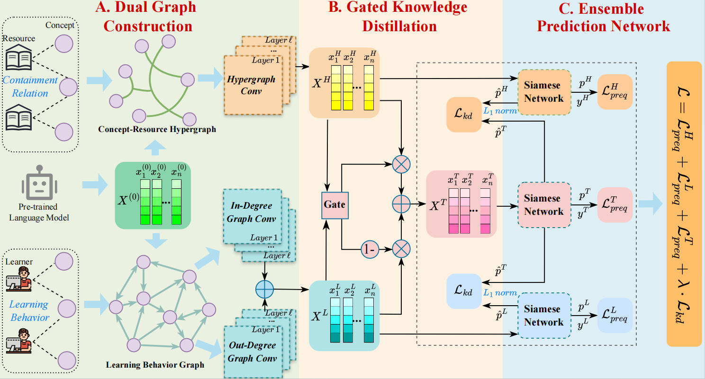

<div align="center">

# [IJCAI 2025] DGCPL: Dual Graph Distillation for Concept Prerequisite Relation Learning <a href="https://github.com/wisejw/DGCPL"></a>

### <div align="center"> [[Paper]](https://github.com/wisejw/DGCPL/blob/main/paper/IJCAI2025_DGCPL_Paper.pdf) [[Appendix]](https://github.com/wisejw/DGCPL/blob/main/paper/IJCAI2025_DGCPL_Appendix.pdf) [[Presentation]](https://github.com/wisejw/DGCPL/blob/main/paper/IJCAI2025_DGCPL_Presentation.pdf) [[Poster]](https://github.com/wisejw/DGCPL/blob/main/paper/IJCAI2025_DGCPL_Poster.pdf) </div>

**DGCPL** is a novel dual graph distillation approach for concept prerequisite relation learning. [doi].

> **Miao Zhang**, <a href="https://wisejw.github.io/"><strong>Jiawei Wang</strong></a>, **Jinying Han**, **Kui Xiao**<sup>✉</sup>, **Zhifei Li**, **Yan Zhang**, **Hao Chen**, **Shihui Wang**. <br>DGCPL: Dual Graph Distillation for Concept Prerequisite Relation Learning. IJCAI 2025 Main Track on Natural Language Processing.

<p>


</p>




</div>

In this paper, we introduce **DGCPL** (**D**ual **G**raph Distillation for **C**oncept **P**rerequisite Relation **L**earning), a novel deep learning model that effectively predicts concept prerequisite relations by leveraging both knowledge and learning behavior perspectives. As illustrated in Figure, DGCPL constructs a dual graph structure to capture high-order knowledge and learner behavior features through the Concept-Resource Hypergraph and Learning Behavior Graph, respectively. By using a gated knowledge distillation mechanism, DGCPL fuses these features to obtain comprehensive concept embeddings for accurate prediction of prerequisite relations.

## 🛠 Installation

Ensure you have Python 3.7+ and the required dependencies installed. 

Make sure you have the following Python packages installed:

- torch==2.1.2+cu121
- torch-cluster==1.6.3+pt21cu121
- torch-geometric==2.5.3
- torch-scatter==2.1.2+pt21cu121
- torch-sparse==0.6.18+pt21cu121
- torch-spline-conv==1.2.2+pt21cu121
- scikit-learn==1.2.0
- pandas==1.5.3
- numpy==1.24.2


## 📢 Project Structure

The project is organized as follows:

```plain
│  README.md	    # Project documentation.
│  environment.txt	    # Required Python packages.   
│  environment.yml	    # Required Python packages.    
├─data    # The training, validation, and testing data files. 
│  ├─MOOC
│  │      bert_embeddings.csv
│  │      clickStreamLink_data_id.csv
│  │      concepts_index.csv
│  │      cs_courses.csv
│  │      Hypergraph_H.csv
│  │      MOOC_data.csv
│  │      resources_index.csv
│  │      test.csv
│  │      train.csv
│  │      val.csv
├─logs
│  ├─MOOC 
├─best_model
│  ├─MOOC
│  │      MC-DGCPL_best_net.pth     # The best network weights from MC-DGCPL model training.
├─load_data
│      load_DGCN_data.py
│      load_HGNN_data.py
└─utils
│       eval_performance.py
│       loss_function.py
│       set_logger.py
│       set_seed.py
│  layers.py
│  HyperGNN.py    # Implementation of Hypergraph Neural Network (HGNN) model.
│  DirectedGCN.py    # Implementation of Directed Graph Convolution Network (DGCN) model.
│  SiameseNet.py    # Implementation of Siamese Network model.
│  model.py	# Model definitions.
│  train.py	# Training script.
│  test.py	    # Testing script.
│  train.sh	# Shell script for training.
│  test.sh	    # Shell script for testing.
```


## 🚀 Usage

### 🎯 Training

You can train the model in two ways: by using the train.sh script or directly executing the train.py script.

- Using the train.sh script: Simply run `bash train.sh`, and the script will automatically set the necessary parameters and start training.

- Using the train.py script: If you prefer to manually set the parameters, you can execute train.py directly via the command line, like so:
`python train.py \
    --in_channels 768 \
    --out_channels1 256 \
    --out_channels2 256 \
    --epochs 50 \
    --batch_size 16 \
    --kd_loss_weight 1E-5 \
    --lr 0.0001 \
    --weight_decay 1E-3 \
    --dropout_rate 0.5 \
    --T 0.5 \
    --seed 42 \
    --dataset MOOC`

This script will:
1. Load the MOOC dataset and initialize the model.
2. Train the model for a specified number of epochs.
3. Save the best model based on validation AUC.

### 📖 Testing

You can test the model in two ways: by using the test.sh script or directly executing the test.py script.

- Using the test.sh script: Simply run `bash test.sh`, and the script will automatically load the required parameters and start testing.
- Using the test.py script: If you prefer to manually specify the parameters, you can execute test.py directly via the command line, like so:
`python test.py \
    --dataset MOOC`

This script will:
1. Load the test dataset and the best model checkpoint.
2. Evaluate the model's performance on the test set.


## 🔥 Parameters

Both training and testing scripts accept several command-line arguments to control the behavior of the model:

- --in_channels: Input channel size.
- --out_channels1: Output channel size for the first layer.
- --out_channels2: Output channel size for the second layer.
- --epochs: Number of training epochs.
- --batch_size: Batch size for training.
- --kd_loss_weight: Weight for distillation loss.
- --lr: Learning rate.
- --weight_decay: Weight decay for the optimizer.
- --dropout_rate: Dropout rate for regularization.
- --T: Temperature coefficient for distillation.
- --seed: Random seed for reproducibility.
- --dataset: Name of the dataset to use.


## ✨ Logging

Both training and testing outputs are logged to timestamped files in the logs/ directory. Each log file is named based on the operation (train/test), dataset, and the time of execution.


## 📌 Citation

Please cite the following paper if you find our code helpful.

```bibtex
@inproceedings{ijcai2025dgcpl,
  title     = {DGCPL: Dual Graph Distillation for Concept Prerequisite Relation Learning},
  author    = {Zhang, Miao and Wang, Jiawei and Han, Jinying and Xiao, Kui and Li, Zhifei and Zhang, Yan and Chen, Hao and Wang, Shihui},
  booktitle = {Proceedings of the Thirty-Fourth International Joint Conference on
               Artificial Intelligence, {IJCAI-25}},
  publisher = {International Joint Conferences on Artificial Intelligence Organization},
  editor    = {James Kwok},
  pages     = {8366--8374},
  year      = {2025},
  month     = {8},
  note      = {Main Track},
  doi       = {10.24963/ijcai.2025/930},
  url       = {https://doi.org/10.24963/ijcai.2025/930},
}
```

