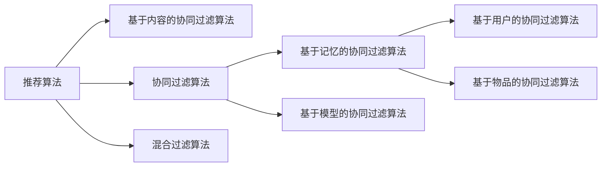

# 协同过滤算法

协同过滤算法有两种常用的算法，一种是基于物品的协同过滤方法，另一种是基于用户的协同过滤方法。两种算法的原理比较相似，都是通过相似度计算公式计算用户或者物品之间的相似度，并为目标用户寻找到最近邻，从而进行推荐。

### 推荐算法关系图：

协同过滤算法主要分为基于记忆的协同过滤（CF）和基于模型的协同过滤。基于记忆的协同过滤算法又可细分为基于用户的协同过滤算法和基于物品的协同过滤算法。其中，基于用户的协同过滤是最早出现的推荐算法，该算法首先计算与目标用户兴趣相似的用户群体，再从相似用户集合中推荐该用户可能喜欢的物品。而基于物品的协同过滤算法则是向用户推荐与其过往喜好物品相似的物品。

基于模型的协同过滤算法主要通过机器学习与数据挖掘技术，运用分类、回归、矩阵分解等算法来提取用户与物品间的隐含模式。基于内容的推荐算法则通过分析物品内容信息，提取用户对物品的兴趣偏好。

值得注意的是，基于内容的推荐算法与协同过滤推荐算法各自存在局限性。混合推荐算法通过融合多种推荐技术，有效弥补了单一推荐模型的不足。

## 基于内容的协同过滤算法

基于内容的协同过滤算法（Content-Based Collaborative Filtering）。它通过分析物品的内容特征和用户的偏好历史，为用户推荐与其过去喜欢的物品在内容上相似的物品。该算法主要分为三个步骤：

1. **提取项目特征**：建立每个项目的信息特征。

2. **提取用户特征**：根据用户的行为信息建立用户的偏好特征。

3. **推荐**：将用户的偏好特征与项目信息表征进行比对，为用户推荐合适的内容。

其中对内容特征信息的提取是基于内容的协同过滤算法的核心步骤，这一关键操作对内容的结构性特征要求很高，用户所感兴趣之处须和内容特征比较贴合，因此该算法比较适合对文本进行处理。而对于很难将内容特征化的视频、音频等非文本资源时，此算法在运用中有一定局限性。

 

## 基于用户的协同过滤算法

基于用户的协同过滤算法（User-Based Collaborative Filtering）是最早出现的推荐算法。通常来说，有些用户之间所偏爱的项目是有相似之处，这也是基于用户的协同过滤算法为目标用户产生推荐的依据，其核心思想是：使用相似度计算公式计算用户之间的相似度，进而找到推荐用户的近邻集合，并对项目预测评分，最终将评分靠前的项目推荐给目标用户。假设某位用户想在他的歌单添加一首新歌，他可能会询问和自己兴趣相似的朋友一些建议，比如他的好友最近在听《正好逍遥》这首歌，那么这位用户喜欢《正好逍遥》这首歌概率就会很大，将自己近邻好友的兴趣偏好推荐给你，其实这就是基于用户的协同过滤算法的所被运用到的实际场景。

 

如图所示，用户喜欢某个项目用实线来表示，将项目推荐给用户的过程用虚线来表示。从图中可以看出项目 1、2、4 都受到用户 B 的喜欢，项目 2、4 受到用户 C 的喜欢，因此通过上述用户行为信息可以判断用户  B 和用户  C  的兴趣爱好比较相似，通常将项目 1 推
荐至用户 C

### 基于用户的协同过滤算法主要分为以下三个步骤：

1. **构建用户-物品评分矩阵**：首先，收集用户和系统的交互行为数据，这些数据会以各式各样的形式存在，如对项目进行关注、点赞、或者评分这些行为等。建立一个m n  的矩阵S(m, n) 来表示用户对项目的行为信息，其中 m 表示用户的数量，n 表示项目的数量，ijs 代表用户 i 对项目 j 的评分值。ijs 评分值越高，说明用户对此项目的喜爱度越高，用户评分矩阵如下所示：  
   $
   S(m,n) = \begin{pmatrix}s_{11} & s_{12} & \cdots &s_{1n}\\s_{21} & s_{22} & \cdots &s_{2n}\\ \vdots & \vdots & \ddots & \vdots \\s_{m1} & s_{m2} & \cdots &s_{mn}\end{pmatrix}
   $

2. **计算相似度矩阵**：通过上述的用户—项目评分矩阵中用户对项目的评分数据，再结合相似度计算方式，确定偏好相似的用户集，常用的用户相似度计算公式主要有余弦相似度、皮尔逊相似度以及修
正的余弦相似度三种
   #### 相似度
   - **余弦相似度**  
   余弦相似度衡量两个向量在方向上的相似性，公式为：  
   $
   sim_{cos}(u, v) = \frac{\sum_{i \in I_{uv}} r_{u,i} \cdot r_{v,i}}{\sqrt{\sum_{i \in I_{uv}} r_{u,i}^2} \cdot \sqrt{\sum_{i \in I_{uv}} r_{v,i}^2}}
   $
   其中,$I_{uv}$ 是用户u和v共同评分的物品集合，$r_{u,i}$ 是用户u对物品i的评分。

   - **皮尔逊相似度**  
   皮尔逊相似度考虑了用户的平均评分，公式为：  
   $
   {sim}(u, v) = \frac{\sum_{i \in I_{uv}} (r_{u,i} - \bar{r}_u) \cdot (r_{v,i} - \bar{r}_v)}{\sqrt{\sum_{i \in I_{uv}} (r_{u,i} - \bar{r}_u)^2} \cdot \sqrt{\sum_{i \in I_{uv}} (r_{v,i} - \bar{r}_v)^2}}
   $
   其中，$\bar{r}_u$ 是用户u的平均评分。

   - **修正余弦相似度**  
   修正余弦相似度进一步调整了皮尔逊相似度，公式为：  
   $
   {sim}(u, v) = \frac{\sum_{i \in I_{uv}} (r_{u,i} - \bar{r}_i) \cdot (r_{v,i} - \bar{r}_i)}{\sqrt{\sum_{i \in I_{uv}} (r_{u,i} - \bar{r}_i)^2} \cdot \sqrt{\sum_{i \in I_{uv}} (r_{v,i} - \bar{r}_i)^2}}
   $ 
   其中，$\bar{r}_i$ 是物品i的平均评分。
1. **产生推荐**：根据用户之间的相似度大小地排序可以得出目标用户的最近邻用户，KNN 算法的主要原理是将测试数据集与训练数据集进行相似性比对，从而选出  Top-N  的用户，得到近邻集合，此算法为接下来预测项目的评分值提供基础，取评分较高的项目推荐给目标用户。

## 基于物品的协同过滤算法

基于物品的协同过滤算法（Item-Based Collaborative Filtering）向用户推荐与其过往喜好物品相似的物品。该算法假设用户会喜欢与他们过去喜欢的物品相似的物品。

比如用户在课程推荐系统关注了通信原理这门课程，系统可能会为用户推荐计算机网络等相关类型的课程。这样的推荐方式就是通过基于项目的协同过滤推荐算法实现的，该算法的基本步骤与基于用户的协同过滤算法的步骤类似，只是在第二步的计算过程中，将计算用户之间的相似度替换为计算项目之间的相似度。但是仍然可以使用基于用户的协同过滤算法中相似性计算公式来得到近邻项目集合。

## 基于模型的协同过滤算法

推荐算法模型中输入的数据源（用户评分矩阵）中，有些项目是没有被用户进行评分的，此时可以根据已经收集的评分数据进行训练，来对未评分的项目进行预测评分，选择评分高的项目推荐给用户。为了更好地应对上述问题，可以通过使用机器学习的方法来建立模型，主流方法包括：关联算法，分类算法，聚类算法，回归算法，神经网络，矩阵分
解等。

### 常见方法：

1. **矩阵分解 (Matrix Factorization)**：如SVD（奇异值分解），将用户-物品评分矩阵分解为用户特征矩阵和物品特征矩阵。公式为：  
   $
   R \approx P \cdot Q^T
   $  
   其中，R是评分矩阵，P是用户矩阵，Q是物品矩阵。

2. **聚类算法**：将用户或物品分组，然后在组内进行推荐。

3. **神经网络**：使用深度学习模型，如Autoencoder或神经协同过滤 (NCF)，学习用户和物品的潜在表示。

基于模型的方法可以处理大规模数据，且能捕捉复杂的非线性关系，但需要更多计算资源。

## 对协同过滤算法的修正

1. ### 基于用户特征权重置信度的协同过滤推荐算法

随着线上选课体系的不断完善，参与的用户也随之增多，由于每位用户对课程的需求不同，他们并不是对所有课程进行评分，因此建立的用户—课程评分矩阵的稀疏性很大，就好比用户 A 只对一个感兴趣的课程进行评分，用户 B 评分的课程比较多，并且用户 B 所评分的课程恰好包括了用户 A 所评分的课程，这种情况在获得最近邻居集合的时候，并不能准确地反映用户的真实喜好。上述内容仅仅只是阐述用户与课程之间的关系，然而一个系统的信息量非常庞大并且信息之间的关系也极为复杂，如果仅仅是通过信息中的数字内容来探究推荐算法，会缺乏说服性，最终导致推荐的效果不是很理想。因此我们可以对用户评分数据深层的关系进行细致探索，以及将用户文本化的特征属性模型化，来进一步对协同过滤算法改进。为了更好地提高推荐的质量，提出了基于用户特征权重置信度的协同过滤算法（Collaborative filtering algorithm based on user feature weight reset reliability，CFUR）。 

#### 算法改进

   - 用户间学习行为特征权重 
   欧几里得度量[62]可以通过距离大小来衡量用户之间的相似度，其实质是距离值与用户之间的相似度成反比。因此根据此算法来计算用户间学习行为权重，如下式所示。  
   $
      wei_{time} = sim_{time}(a,b) = \frac{1}{1+d(a,b)} =
      \frac{1}{1+\sqrt{(\frac{L_{time_a}}{S_{time_a}} - \frac{L_{time_b}}{S_{time_b}})^2}}
   $
   其中$\frac{L_{time_a}}{S_{time_a}}$,$\frac{L_{time_b}}{S_{time_b}}$分别代表用户 a 和用户 b 学习课程的时间占课程总时间的比重。$time_{wei}$ 代表用户间学习行为特征权重.
   - 用户间其他特征权重
   除了用户学习某课程时长这一学习行为特征外，还有一些用户特征在注册时填写相关的文本信息，假设用户 a 的特征属性集合 X 为$\{x_1,x_2, \cdots, x_n\}$，用户 b 的特征属性集合 Y 为$\{y_1,y_2\cdots, y_n\}$，通过下式来计算用户之间其它特征权重。

      $F(a,b) = |X\cap Y|$

      $wei_{other} = \frac{F(a,b)}{sum_{other}}$
   最终的用户特征权重$wei_{user}$ 计算公式:

   $wei_{user} = \alpha \cdot wei_{time} + (1-\alpha)$

1. ### 基于热门度修正因子的协同过滤推荐算法

传统的协同过滤算法过度依赖用户共同有过评分记录项目的评分值，而没有重视此项目热门度的大小，造成最终的推荐结果精确度较低，这是由于在计算用户之间的相似度时没有考虑到项目热门度这一重要因素。以高校学生选择课程为例。例如，两名学生都选择过近代史这门课程，这并不能说明用户之间所感兴趣的课程都是相似的，这是因为近代史这门课程是必修课，大多数学生必须选择这门课程来完成必修的学分，并不能认为用户之间的相似度比较高。如果两名学生都选择了音乐鉴赏这门课程，那么可以认为这两名学生感兴趣的内容是相似的，这是因为只有对音乐感兴趣的学生才会选择这门课程。所以在计算用户之间的相似度时必须考虑冷门项目对其影响，一些用户对热门项目做出反馈这种行为并不能充分体现用户之间的区别，如果想进一步挖掘用户的喜爱偏好，可以关注用户对小众项目的反馈行为。因此提出了热门度修正因子这一概念，此公式不是对所有的项目进行修正，而是通过相应的热门阈值来判断是否对此项目进行修正.

