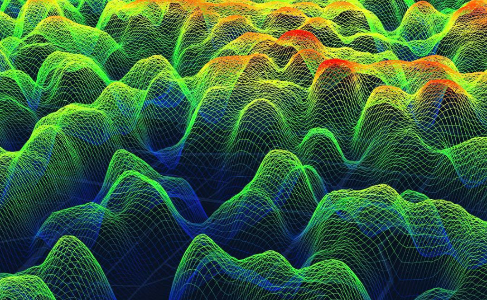

# 额外学习的内容

## 1. 决策树（Decision Tree）
决策树（Decision Tree）是一种常用的机器学习算法，广泛应用于分类和回归问题。

决策树通过树状结构来表示决策过程，每个内部节点代表一个特征或属性的测试，每个分支代表测试的结果，每个叶节点代表一个类别或值。

### 决策树的基本概念
- 节点（Node）：树中的每个点称为节点。根节点是树的起点，内部节点是决策点，叶节点是最终的决策结果。
- 分支（Branch）：从一个节点到另一个节点的路径称为分支。
- 分裂（Split）：根据某个特征将数据集分成多个子集的过程。
- 纯度（Purity）：衡量一个子集中样本的类别是否一致。纯度越高，说明子集中的样本越相似。
### 决策树的工作原理
决策树通过递归地将数据集分割成更小的子集来构建树结构。具体步骤如下：

- 选择最佳特征：根据某种标准（如信息增益、基尼指数等）选择最佳特征进行分割。
- 分割数据集：根据选定的特征将数据集分成多个子集。
- 递归构建子树：对每个子集重复上述过程，直到满足停止条件（如所有样本属于同一类别、达到最大深度等）。
- 生成叶节点：当满足停止条件时，生成叶节点并赋予类别或值。
- 决策树的构建标准
- 在构建决策树时，我们需要选择最佳特征进行分割，常用的标准有：

1. 信息增益（Information Gain）
用于分类问题，衡量选择某一特征后数据集的纯度提升。计算公式为：
 $\sum(IG(D,A) = Entropy(D) - \sum_{v\in A} (\frac{|D_v|}{D}\cdot Entropy(D_v))$

>其中 Entropy 是数据集的熵，用来衡量数据的不确定性。

1. 基尼指数（Gini Index）

也是用于分类问题的分裂标准，计算公式为：
$Gini(D) = 1 - \sum_{k=1}^K (p_i)^2$

>其中 pi 是类别 i 的样本占比$p_i = \frac{|C_k|}{|D|}$.基尼指数越小，表示数据集越纯净。

3. 均方误差（MSE）

用于回归问题，衡量预测值和真实值的差异。

MSE 越小，表示回归树的预测效果越好。

### 决策树的优缺点
#### 优点
- 易于理解和解释：决策树的结构直观，易于理解和解释。
- 处理多种数据类型：可以处理数值型和类别型数据。
- 不需要数据标准化：决策树不需要对数据进行标准化或归一化处理。
#### 缺点
- 容易过拟合：决策树容易过拟合，特别是在数据集较小或树深度较大时。
- 对噪声敏感：决策树对噪声数据较为敏感，可能导致模型性能下降。
- 不稳定：数据的小变化可能导致生成完全不同的树。

## 2. 帕累托优势
TODO:暂时还没看懂。。。:thinking:

[点这里](https://blog.csdn.net/qq_46450354/article/details/127917026)

## 3. 交叉熵

[link](https://zhuanlan.zhihu.com/p/790420874)

### 1. 由来
交叉熵损失（Cross-Entropy Loss）是衡量两个概率分布差异的函数，最早由信息论领域的 Claude Shannon 提出。交叉熵损失广泛应用于机器学习和深度学习模型中，尤其在分类任务中用于优化模型性能。

### 2. 原理
交叉熵损失度量了模型输出的概率分布和真实标签分布 之间的差异。交叉熵越小，表示两个分布越接近，即预测的类别概率分布越接近真实标签。

其数学公式为：
$
    L_{CE} = \sum_{i=1}^{N} -y_i \log(y'_i)
$

其中：

 - 是真实标签
 - 是模型预测的概率分布
 - 是分类类别的数量
  
交叉熵损失的目标是最小化该值，使得模型输出的预测概率与真实标签的分布尽可能接近。

### 3.使用场景
交叉熵损失主要用于分类任务中，特别是：

- 二分类任务：如判断图像是否包含目标物体。
- 多分类任务：如文本分类、情感分析、手写数字识别等。
- 语言模型：预测下一个单词或字符的概率。

> 交叉熵损失函数在分类任务中起着至关重要的作用，通过最小化损失函数，神经网络能够逐步学习到更精确的分类边界。不同的交叉熵变体可以适应不同类型的分类任务。

## 4. KL散度

[link](https://blog.palind-rome.top/2025/07/11/KL%E6%95%A3%E5%BA%A6%EF%BC%88KL-Divergence%EF%BC%89%E5%AD%A6%E4%B9%A0%E7%AC%94%E8%AE%B0/)

## 5.知识蒸馏
[link](https://zhuanlan.zhihu.com/p/1935796159261148086)
> 只给出概念，概念我以经看懂了，具体的算法实现还需要学习。
###  概念：
#### 一、核心思想：一个“名师出高徒”的现代隐喻
要理解知识蒸馏，我们不妨先想象一个经典的师徒传承故事。

故事中有一位“教师模型”（Teacher Model），他是一位学识渊博、经验丰富的专家（如GPT-4）。他几乎无所不知，能解决各种疑难杂症，但他的思考过程极为复杂缜密，导致他回应速度缓慢，并且需要一间庞大的“书房”（昂贵的计算资源）来存放他的知识典籍。

同时，我们还有一个渴望成才的“学生模型”（Student Model）。他是一个更小、更轻量的网络（如Phi-3或自定义的Transformer）。他天资聪颖，但阅历尚浅，我们希望他能快速成长。学生的目标不是一字不差地背诵老师的所有藏书，而是要学习老师分析问题、解决问题的思维方式和直觉。最终，这位学生虽然只需要一个小小的“工位”（廉价的计算资源），却能快速、高效地处理绝大多数问题，展现出远超其体量所能企及的智慧。

知识蒸馏，正是这样一个让“教师模型”将其深邃的“知识”系统性地传授给轻量级“学生模型”的过程。 通过这种方式，学生得以继承老师的“智慧”，而非仅仅模仿其“行为”，从而实现性能与效率的理想平衡。

#### 二、蒸馏的精髓：发掘“暗知识”的价值
传统的模型训练，是让模型直接从“硬标签”（Hard Labels）中学习。例如，在处理一张猫的图片时，它的标签是 [0, 1, 0]（假设类别顺序为：狗、猫、鱼）。这个标签冷冰冰地告诉模型：“这张图是猫，不是狗，也不是鱼”。这种非黑即白的监督方式虽然有效，却忽略了大量有价值的信息。

现在，让我们看看“教师模型”是如何看待这张图片的。作为一个见多识广的专家，当它看到一张带有虎斑、体型酷似小型犬的猫时，它的判断可能不是一个绝对值，而是一个概率分布，比如 [0.05, 0.7, 0.001, 0.249]（假设类别为：狗、猫、鱼、老虎）。这个分布传递了远比硬标签丰富得多的信息：

主要判断：这张图最可能是猫（概率为70%）。
相似性信息：它和老虎也有一定的相似度（概率约25%），这揭示了在模型的“认知空间”中，这个样本与“老虎”这个概念的相似度。同时，它和狗也有微弱的相似性（5%）。
不相关性信息：它基本不可能是鱼（概率极低）。
这种蕴含在类别间概率关系中的宝贵信息，正是Geoffrey Hinton所提出的“暗知识”（Dark Knowledge）。它反映了教师模型对数据内在结构的深刻理解。知识蒸馏的核心目标，正是让学生模型去学习教师模型输出的、这个富含“暗知识”的完整概率分布。

## 6.超图
>**超图，顾名思义就是比图更牛逼的玩意。**

[link](https://zhuanlan.zhihu.com/p/361471954)

## 7.拉普拉斯矩阵
 ## **直接看链接**
 ## [link](https://zhuanlan.zhihu.com/p/362005297#:~:text=%E8%80%83%E8%99%91%E5%88%B0%E5%90%8E%E9%9D%A2%E5%8F%AF%E8%83%BD%E8%A6%81%E8%BF%9E%E7%BB%AD%E6%9B%B4%E6%96%B0%E5%A5%BD%E5%87%A0%E6%9C%9F%E6%9C%89%E5%85%B3%E8%B6%85%E5%9B%BE%E7%9A%84%E4%B8%9C%E8%A5%BF%EF%BC%8C%E6%89%80%E4%BB%A5%E7%B4%A2%E6%80%A7%E5%B0%B1%E5%A4%9A%E5%86%99%E5%87%A0%E7%AF%87%E8%83%8C%E6%99%AF%E7%9F%A5%E8%AF%86%E7%B1%BB%E7%9A%84%E4%B8%9C%E8%A5%BF%E4%B8%BA%E5%90%8E%E9%9D%A2%E5%81%9A%E9%93%BA%E5%9E%AB%EF%BC%8C%E5%90%8C%E6%97%B6%E4%B9%9F%E7%BB%99%E8%87%AA%E5%B7%B1%E5%81%9A%E4%B8%AA%E5%A4%8D%E4%B9%A0%E6%80%BB%E7%BB%93%E3%80%82%E8%BF%99%E6%AC%A1%E6%88%91%E4%BC%9A%E5%85%88%E4%BB%8E%E6%97%A0%E5%90%91%E5%9B%BE%E7%9A%84%E6%8B%89%E6%99%AE%E6%8B%89%E6%96%AF%E7%9F%A9%E9%98%B5%E5%BB%B6%E4%BC%B8%E5%88%B0%E8%B6%85%E5%9B%BE%E6%8B%89%E6%99%AE%E6%8B%89%E6%96%AF%E7%9F%A9%E9%98%B5%E3%80%82%E5%8F%82%E8%80%83%E6%96%87%E7%AB%A0%E5%8F%8A%E6%96%87%E7%8C%AE%E5%9C%A8)

 

## 8.随机游走

 **直接看链接**
 >**叩拜大佬的博客**
 [link](https://qi-zhan.github.io/blog/2023/randomwalk/)
 [link](https://oi-wiki.org/graph/graph-random-walk/)

# [发现一个宝藏网站！](https://oi-wiki.org/)

## 9.BERT

[link](https://www.runoob.com/nlp/bert-encoder.html)
[link](https://zhuanlan.zhihu.com/p/109250703)

## 10.DSSM

[link](https://www.zhihu.com/tardis/zm/art/335112207?source_id=1005)

## 11.图神经网络

[link](https://www.kakublog.cn/blog/%E5%9B%BE%E7%A5%9E%E7%BB%8F%E7%BD%91%E7%BB%9C#heading-1)
[link](https://www.bilibili.com/video/BV1yP4y1976Z/?mcid=EB382EFF45A44DF8B000CFBECF0E113A&vd_source=83b692f3095f055a3c545cba862ad1cb)

### 11.1.one-hot编码

[link](https://zhuanlan.zhihu.com/p/134495345)

## 12.超图神经网络(HGNN)

[link](https://renzehua1998.github.io/2023/09/02/%E8%AE%BA%E6%96%87%E9%98%85%E8%AF%BB-%E8%B6%85%E5%9B%BE%E7%A5%9E%E7%BB%8F%E7%BD%91%E7%BB%9C/)

## 13.嵌入(embedding)

[link](https://gukirito.github.io/2026-05-13-embedding/)

### 一句话解释#
> Embedding（嵌入）就是把一段文字、一张图、一段音频变成一串数字，这串数字代表它的"语义"——意思相近的东西，数字也相近。

Embedding 是把"语义"变成"数学"的桥梁。它让计算机能够"理解"内容的含义，而不仅仅是匹配表面的文字。理解了 Embedding，你就理解了为什么大模型能够做搜索、做推荐、做知识库问答。